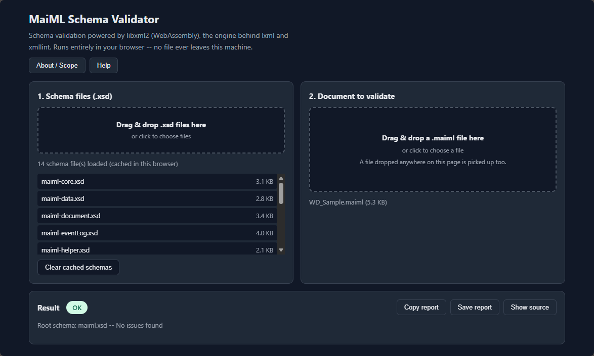
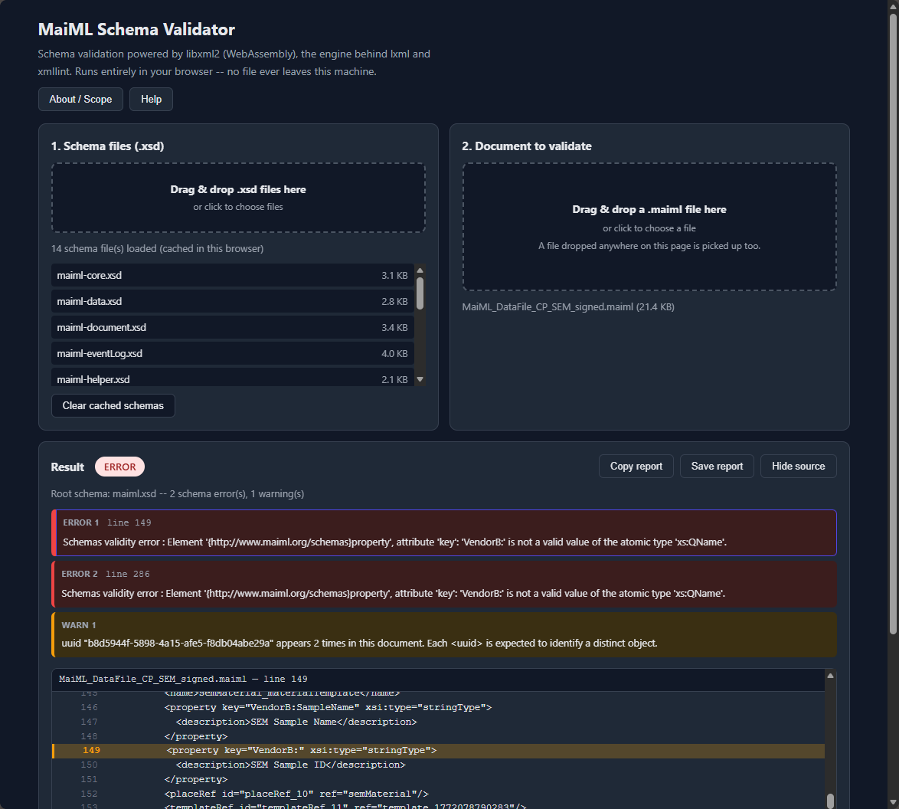

  

# MaiML Validator

**MaiML Validator** is a web application that validates [MaiML (Measurement Analysis Instrument Markup Language)](http://www.maiml.org/) files against the JIS K 0200 schemas.

Open the HTML file in Chrome or Edge and it runs — no installation required. **The document and schema files you load are never uploaded anywhere.**

  

---

## Highlights

- **A real validation engine** — **libxml2** compiled to WebAssembly and embedded in the page. This is the same engine used by `lxml` and the `xmllint` command line tool, so you get command-line-grade validation inside the browser
- **No server, no install** — a single HTML file that also works offline
- **Three-tier verdict (OK / WARN / ERROR)** — what could not be fully checked is neither buried in OK nor confused with ERROR
- **Checks MaiML conventions that XSD cannot express** — IDREF resolution, duplicate UUIDs, the `<log>`-to-`<method>` pairing
- **Jump to the offending line** — click any error with a line number and the source panel scrolls to it
- **Schemas are cached** — load them once and they are remembered for next time

---

## Usage

### Install and run

1. Download `MaiMLValidator.html`
2. Open it directly in a browser (no server needed)
3. Or serve it from any web server

### Getting the schema (XSD)

**The schema is not bundled with this tool.** The JIS K 0200 schema definition files are distributed on the MaiML site, which is run by JAIMA (Japan Analytical Instruments Manufacturers' Association).

On the [English page of the MaiML site](https://www.maiml.org/index_en.html) the schema set is a direct download — **no registration is required**:

- **[MaiML-Schema-1_0.zip](https://www.maiml.org/files/top_en/MaiML-Schema-1_0.zip)** (ZIP, 16 KB)

Unzip it, then load all of the `.xsd` files into this tool in one go (see "Basic workflow" below). Do not include a second copy or an older revision of the same schema, though (see "Notes › Root schema resolution").

The same page also offers the JIS K 0200 standard, the conformance guideline, and *Concept of MaiML* as PDFs.

> 📌 **This is a different tool from the LINQPad-based schema check distributed on the same page.**
> That page also offers `MaiML_Schema_Check_Manual.pdf` and `MaiMLChecker_LINQPad8.zip` — a schema-check procedure and script that run under LINQPad. MaiML Validator was developed independently of those: it validates with libxml2 (WebAssembly), entirely inside the browser, with nothing to install. You can use it instead of that script, but **the two use different validation engines, so their verdicts will not necessarily agree.**

### Basic workflow

1. **Load the JIS K 0200 `.xsd` schema files**
   Drag and drop, or choose files. **Load the whole schema set — every `.xsd` file — in one go.** You do not have to work out which files are needed: only the files actually referenced from the document you validate are used, and the rest are ignored.
   Loaded schemas are cached in this browser (`localStorage`), so you do not need to reload them next time.
2. **Load the `.maiml` or `.xml` document you want to validate**
3. **Read the result**
   The coloured badge shows the overall verdict (OK / WARN / ERROR), and the summary line shows which schema file was selected as the document root schema.
4. **Jump to a problem**
   Click any error or warning that has a line number to jump to that line in the **Show source** panel below the report.
5. **Keep the result**
   Use **Copy report** or **Save report** for a plain-text copy.

> 📌 You can drop files **anywhere on the page**. Routing is by extension: `.xsd` loads as schemas, `.maiml` / `.xml` as the document to validate.

---

## The three tiers

  

| Verdict | Meaning |
|------|------|
| ✅ **OK** | No issues of any kind found |
| ⚠️ **WARN** | No schema violation, but **something could not be fully checked**, or something looks like a mistake |
| ❌ **ERROR** | A real schema violation, or a dangling IDREF |

**WARN is intentionally kept separate from both OK and ERROR.** Folding it into ERROR would reject documents that are legitimately schema-valid; folding it into OK would silently hide the parts of the document this tool could not verify.

A WARN means one of the following:

- An element was accepted only because the schema declares an open `xs:any processContents="lax"` wildcard for a namespace with no schema loaded, so **its content was never actually checked**
- One of the MaiML-specific checks below fired

---

## What is checked

### Schema validation (libxml2)

Element and attribute names, content models, occurrence counts, ordering, data types, patterns, and namespaces — the full structural check XSD provides.

### IDREF → ID resolution

**This is a check libxml2 does not perform, added independently on top of it.** The XSD specification requires that every `xs:IDREF` point at a declared `xs:ID` — Apache Xerces reports this as `cvc-id.1` — but libxml2 does not verify it.

This matters for MaiML: Petri-net arcs (`arc/@source`, `arc/@target`) and event-log references rely on it, so a dangling reference is a real defect that would otherwise pass silently.

Which attributes are typed ID / IDREF(S) is **read from the schemas you loaded**, so the check follows schema revisions automatically.

### MaiML-specific checks (WARN)

Conventions the schema itself cannot express.

| Check | Description |
|---|---|
| **Non-ASCII identifiers** | An ID / IDREF / QName-typed value uses non-ASCII characters. It is schema-valid, but non-ASCII identifiers are known to break MaiML tooling |
| **Duplicate `<uuid>`** | The same UUID appears more than once in the document. Each `<uuid>` is expected to identify a distinct object |
| **`<log>` / `<method>` pairing** | JIS K 0200 6.5.2 expects exactly one `<log>` per `<method>`. Repeated measurements are expressed by adding `<trace>` elements inside that one log, not by adding more logs |

---

## What is NOT checked

- **Anything in a namespace whose schema was not loaded**, beyond flagging it as WARN
- **Business rules outside the checks above** — for example whether measurement values are scientifically plausible
- **XML digital signatures**
  Signature *syntax* is schema-checked, but signature *verification* is not part of this tool. For that, see [MaiMLStandaloneViewer](https://github.com/MaiML-Tools/MaiMLStandaloneViewer)

---

## Schema language version

libxml2 implements **XSD 1.0**, the W3C schema language the JIS K 0200 schemas are written in. This is the version of the *schema language* and is unrelated to the version of the *MaiML document* (the `version` attribute on the root element). The tool validates whatever MaiML version the schemas you load describe.

Schemas that use constructs added in XSD 1.1 (`xs:assert`, `xs:alternative`, `xs:openContent`, `xs:override`) are **rejected with an explicit error** naming the construct and its line. They are never silently ignored, so a document can never be reported valid against a rule that was not actually applied.

A schema that merely declares `vc:minVersion="1.1"` without using those constructs validates normally.

---

## Notes

### Root schema resolution

The `Root schema:` value in the summary line is found by looking for **the schema file that declares a global element matching the root element of the document being validated**. No file name is hard-coded, so the tool keeps working if a revised standard renames it.

If more than one loaded schema file declares the same root element, the choice is ambiguous. Remove the older or variant copy of the same file (for example a `*_rev0.xsd` / `*_import.xsd` variant, or a copy kept as a backup). **If you keep an original alongside an edited schema, rename it to something like `.xsd.bak` so it is not picked up.**

### Missing `xs:import` statements

If the schema set you load is missing `xs:import` declarations, this tool supplies them **in an in-memory copy only** before validating. The files you loaded are never modified.

In XSD, declaring a prefix with `xmlns:` does not make another namespace's components available — a separate `xs:import` is required. Without it, strict processors fail to resolve the namespace. Whatever was supplied is recorded in the **Copy report** / **Save report** output.

---

## Requirements

| Item | Detail |
|------|------|
| Browser | Chrome / Edge recommended |
| Server | Not required (opens over `file://`) |
| Network | Not required (works offline) |
| Validation engine | libxml2 (WebAssembly), embedded |

---

## Third-party licences

This tool embeds the following open-source software. The full licence texts are reproduced in the **Help** panel inside the application.

| Software | Licence |
|---|---|
| [libxml2](https://gitlab.gnome.org/GNOME/libxml2) | MIT |
| [xmllint-wasm](https://github.com/noppa/xmllint-wasm) (WebAssembly build of libxml2) | MIT |

---

## Related tools

| Tool | Purpose |
|---|---|
| [MaiML Studio](https://github.com/MaiML-Tools/MaiMLStudio) | Design, author and export MaiML files |
| [MaiML Standalone Viewer](https://github.com/MaiML-Tools/MaiMLStandaloneViewer) | Visualise and analyse MaiML files, verify signatures |
